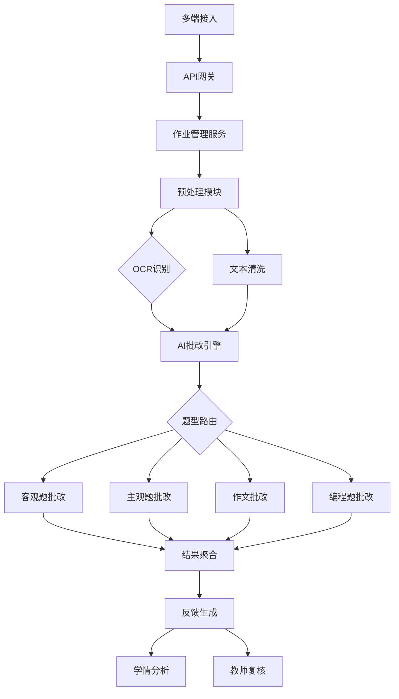

# AI-
AI自动批改作业项目
接下来，我将以多种思考方式同时进行深度思考，每个 Thinker 将会独立给出一个回复，最终我会将这些回复整合成一个更全面的结论。
 # AI自动批改作业项目完整实施方案

## 一、项目核心价值与目标

### 核心价值
AI自动批改系统通过智能化技术解决传统批改的四大痛点：效率低下、成本高昂、反馈延迟、标准不一致。系统可节省教师70%以上的批改时间，实现秒级反馈，并通过数据分析助力精准教学。

### 核心目标
- **准确率**：客观题>99%，主观题>85%
- **效率**：单题批改<3秒，支持1000+并发
- **体验**：提供个性化反馈和学情分析
- **覆盖**：支持10+学科题型

---

## 二、系统技术架构设计

### 2.1 整体架构


### 2.2 分层技术栈

| 层级 | 技术选型 | 说明 |
|------|----------|------|
| **接入层** | Nginx + API Gateway | 负载均衡、限流、认证 |
| **业务层** | FastAPI + Celery | 异步任务处理 |
| **AI服务层** | PyTorch + Transformers | 模型推理服务 |
| **数据层** | PostgreSQL + Redis + MinIO | 结构化/非结构化数据存储 |
| **监控层** | Prometheus + Grafana | 性能指标监控 |

---

## 三、核心功能模块实现

### 3.1 智能批改引擎（核心）

```python
class AIGradingEngine:
    def __init__(self):
        # 加载预训练模型
        self.nlp_model = SentenceTransformer(
            'paraphrase-multilingual-MiniLM-L12-v2'
        )
        self.essay_model = BertForSequenceClassification.from_pretrained(
            'hfl/chinese-bert-wwm', num_labels=5
        )
    
    def grade_objective(self, student_ans, std_ans, tolerance=0.9):
        """客观题批改：支持模糊匹配"""
        from fuzzywuzzy import fuzz
        similarity = fuzz.ratio(student_ans.lower().strip(), 
                               std_ans.lower()) / 100
        return similarity >= tolerance, similarity
    
    def grade_subjective(self, student_ans, std_ans, keywords):
        """主观题批改：语义相似度+关键词覆盖"""
        # 语义相似度
        emb1 = self.nlp_model.encode(student_ans)
        emb2 = self.nlp_model.encode(std_ans)
        similarity = cosine_similarity([emb1], [emb2])[0][0]
        
        # 关键词匹配
        keyword_score = sum(1 for kw in keywords if kw in student_ans) / len(keywords)
        
        # 综合评分
        final_score = 0.6 * similarity + 0.4 * keyword_score
        return min(1.0, final_score)
    
    def grade_essay(self, essay, rubric):
        """作文多维度评分"""
        scores = {
            'content': self._content_relevance(essay, rubric.prompt),
            'structure': self._structure_coherence(essay),
            'language': self._language_quality(essay),
            'convention': self._mechanics_check(essay)
        }
        # 加权计算
        weights = {'content': 0.4, 'structure': 0.3, 
                  'language': 0.2, 'convention': 0.1}
        final_score = sum(scores[k] * weights[k] for k in scores)
        return final_score, scores
```

### 3.2 数学解题批改
```python
def math_validation(student_solution, correct_solution):
    """
    数学解题验证：步骤分+结果分
    """
    # 公式解析
    student_steps = parse_latex(student_solution)
    correct_steps = parse_latex(correct_solution)
    
    # 步骤验证
    step_scores = []
    for i, step in enumerate(student_steps):
        if i >= len(correct_steps):
            break
        # 检查公式等价性（交换律、结合律等）
        is_equivalent = check_equivalence(step, correct_steps[i])
        step_scores.append(1.0 if is_equivalent else 0.0)
    
    # 最终答案验证
    result_score = 1.0 if student_solution.final_answer == correct_solution.final_answer else 0.0
    
    # 综合评分（步骤70% + 结果30%）
    final_score = 0.7 * (sum(step_scores) / len(step_scores)) + 0.3 * result_score
    
    return {
        'score': final_score,
        'step_feedback': generate_step_feedback(step_scores)
    }
```

---

## 四、分学科批改策略

### 4.1 语文/英语
| 题型 | 技术方案 | 评分维度 |
|------|----------|----------|
| **字词填空** | 精确匹配+同义词扩展 | 正确率 |
| **阅读理解** | 语义相似度+关键实体识别 | 信息完整性 |
| **翻译题** | 语义等价性判断 | 准确性、流畅度 |
| **作文** | BERT微调+多维度评估 | 内容、结构、语言、规范 |

### 4.2 数学/物理
- **基础题型**：公式匹配、数值计算验证
- **证明题**：逻辑链完整性检查
- **应用题**：建模过程+结果双重验证
- **关键**：支持多种正确解法，识别等价表达式

### 4.3 编程作业
```python
def code_grading(student_code, test_cases):
    """编程题批改：功能+质量+创新"""
    results = {
        'functional': 0.0,  # 功能测试
        'quality': 0.0,     # 代码质量
        'originality': 0.0  # 原创性
    }
    
    # 1. 功能测试
    for test in test_cases:
        if run_test(student_code, test):
            results['functional'] += 1.0 / len(test_cases)
    
    # 2. 代码质量分析
    results['quality'] = code_quality_analysis(student_code)
    
    # 3. 相似度检测（防抄袭）
    results['originality'] = 1.0 - similarity_check(student_code)
    
    return results
```

---

## 五、实施路线图（12个月）

### **第一阶段：MVP验证（2-3个月）**
- **目标**：验证核心算法可行性
- **范围**：选择题、填空题、判断题
- **技术**：规则引擎+关键词匹配
- **指标**：准确率>95%，支持单科使用

### **第二阶段：功能扩展（4-6个月）**
- **目标**：支持简答题和数学题
- **新增**：BERT语义相似度、公式识别
- **特色**：教师复核界面、基础学情看板
- **指标**：主观题准确率>85%

### **第三阶段：体验优化（7-9个月）**
- **目标**：完整AI批改体验
- **新增**：作文批改、编程题支持
- **特色**：个性化反馈、智能推荐练习
- **指标**：NPS>50，教师采纳率>80%

### **第四阶段：规模推广（10-12个月）**
- **目标**：商业化运营
- **重点**：性能优化、多租户支持
- **扩展**：移动端适配、多语言支持
- **指标**：并发>5000，可用性>99.9%

---

## 六、关键挑战与解决方案

### 挑战1：主观题评分一致性
**问题**：AI评分与教师存在偏差，学生可能觉得不公

**解决方案**：
```python
# 混合批改模式
def hybrid_grading(student_answer, standard_answer):
    ai_score = ai_model.predict(student_answer, standard_answer)
    
    # 低置信度自动转人工
    if ai_score.confidence < 0.7:
        return human_review(student_answer, standard_answer)
    
    # 与历史教师评分差异过大时复核
    teacher_avg = get_teacher_historical_avg()
    if abs(ai_score.value - teacher_avg) > 0.2:
        return trigger_review(ai_score, teacher_avg)
    
    return ai_score
```

### 挑战2：手写识别准确率
**问题**：学生字迹潦草，拍照质量差

**解决策略**：
- **数据增强**：收集10万+学生手写样本训练
- **多OCR引擎融合**：PaddleOCR + Tesseract + 自研模型投票
- **交互式纠错**：无法识别区域高亮，要求学生重新拍照
- **上下文纠错**：结合题目语义纠正识别错误

### 挑战3：创造性答案识别
**问题**：学生新颖但正确的解题思路被误判

**解决方案**：
- 构建**可解释AI(XAI)**模块，验证逻辑链而非简单匹配
- 建立**优秀新颖答案库**，将持续学习这些案例
- 引入**知识图谱**验证概念关联正确性
- 设置**教师快速仲裁通道**

---

## 七、质量保障与评估体系

### 7.1 技术指标
| 指标 | 目标值 | 测量方法 |
|------|--------|----------|
| **批改准确率** | 客观题>99%，主观题>85% | 与专家评分对比 |
| **响应时间** | <3秒/题 | P99延迟监控 |
| **系统可用性** | >99.5% | 在线时长统计 |
| **并发能力** | 1000+ QPS | 压力测试 |

### 7.2 业务指标
- **教师效率提升**：批改时间减少70%+
- **学生满意度**：NPS>50
- **教师采纳率**：月活>80%
- **错误率**：误判率<5%

### 7.3 模型评估
```python
# 评估脚本示例
def evaluate_model(test_dataset):
    metrics = {
        'accuracy': [],
        'f1_score': [],
        'kappa_coefficient': []
    }
    
    for sample in test_dataset:
        ai_score = model.predict(sample.answer, sample.standard)
        teacher_score = sample.teacher_score
        
        # Cohen's Kappa系数（一致性检验）
        kappa = cohens_kappa(ai_score, teacher_score)
        metrics['kappa_coefficient'].append(kappa)
    
    return {k: np.mean(v) for k, v in metrics.items()}
```

---

## 八、推荐技术栈与工具

### 8.1 AI开发
- **NLP基础**：HuggingFace Transformers、spaCy
- **相似度计算**：Sentence-Transformers、FAISS
- **OCR识别**：PaddleOCR、Tesseract、LaTeX-OCR
- **代码分析**：Tree-sitter、CodeBERT

### 8.2 后端开发
- **API框架**：FastAPI（高性能）、Django（全栈）
- **异步处理**：Celery + Redis/RabbitMQ
- **数据库**：PostgreSQL（主库）、MongoDB（作业内容）
- **缓存**：Redis Cluster

### 8.3 基础设施
- **部署**：Docker + Kubernetes
- **监控**：Prometheus + Grafana + ELK
- **云服务**：AWS/GCP/Azure（教育优惠）
- **安全**：JWT认证、数据加密、访问控制

---

## 九、商业化与落地策略

### 9.1 收费模式
1. **SaaS订阅**：学校按学生数收费（30-80元/生/年）
2. **API调用**：按批改次数计费（0.1-0.5元/次）
3. **定制开发**：大客户专属模型训练（10-50万/项目）

### 9.2 市场切入点
- **K12教育**：作业批改为刚需，家校付费意愿强
- **高等教育**：编程、数学等学科需求明确
- **在线教培**：降本增效最直接，付费能力强

### 9.3 实施建议
1. **试点先行**：选择1-2所学校、1-2个学科试点
2. **教师参与**：让教师参与标准制定和模型训练
3. **渐进推广**：从客观题到主观题，从辅助到主导
4. **持续优化**：建立教师反馈闭环，每月迭代模型

---

## 十、未来发展方向

1. **多模态融合**：同时分析文本、公式、图表、手写推导
2. **情感计算**：识别学生答题态度、思维过程
3. **自适应学习**：根据批改结果实时推荐个性化练习
4. **元宇宙教育**：AR/VR环境下的交互式作业与批改
5. **教育大模型**：训练垂直领域的教育专用大模型

---

## 立即行动建议

### 1. 数据准备（第1-2周）
- 收集5000份历史作业数据
- 组织3-5名教师进行双盲标注
- 建立初始评分标准库

### 2. MVP开发（第3-8周）
- 实现选择题、填空题自动批改
- 开发教师复核界面
- 集成基础OCR识别

### 3. 试点验证（第9-12周）
- 选择1个班级试点使用
- 收集教师和学生反馈
- 优化模型和用户体验

---

**总结**：AI自动批改作业项目技术可行、市场刚需，关键是采用"人机协同"策略，让AI学习教师经验，同时保留教师最终裁决权。建议从简单客观题切入，快速验证产品市场匹配度，再逐步扩展到复杂主观题，最终实现规模化应用。

需要我针对某个具体技术模块提供更详细的实现方案吗？
