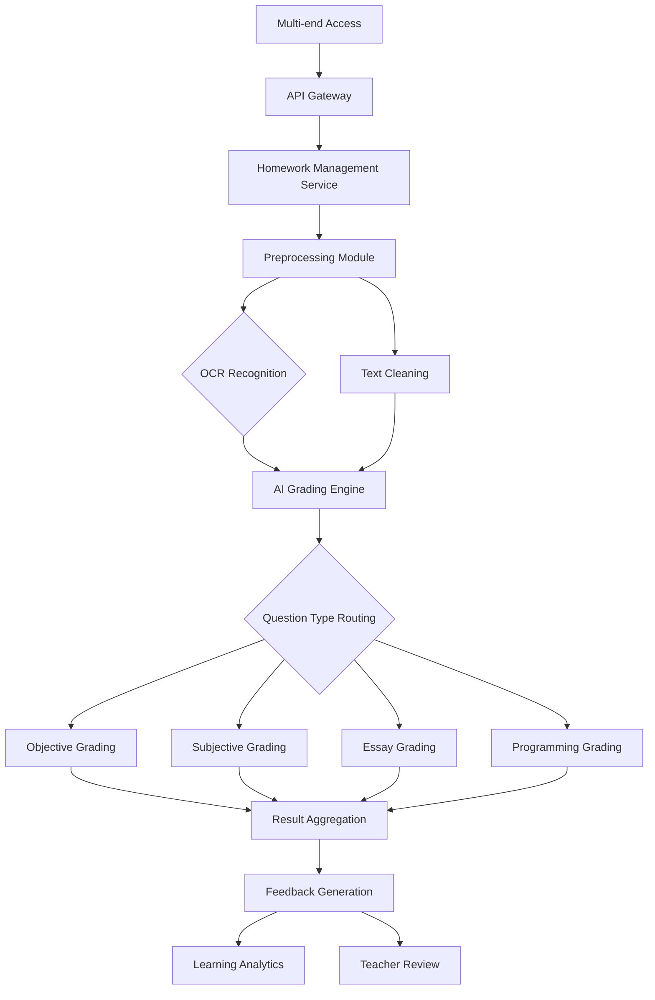

接下来，我将以多种思考方式同时进行深度思考，每个 Thinker 将会独立给出一个回复，最终我会将这些回复整合成一个更全面的结论。

# AI Automatic Homework Grading Project - Complete Implementation Plan

## I. Project Core Value and Objectives

### Core Value
The AI automatic grading system addresses four major pain points of traditional grading through intelligent technology: low efficiency, high costs, delayed feedback, and inconsistent standards. The system can save teachers over 70% of grading time, provide second-level feedback, and enable data-driven precision teaching.

### Core Objectives
- **Accuracy**: Objective questions >99%, Subjective questions >85%
- **Efficiency**: Single question grading <3 seconds, supporting 1000+ concurrent users
- **Experience**: Provide personalized feedback and learning analytics
- **Coverage**: Support 10+ subject question types

---

## II. System Technical Architecture Design

### 2.1 Overall Architecture


### 2.2 Layered Technology Stack

| Layer | Technology Selection | Description |
|-------|---------------------|-------------|
| **Access Layer** | Nginx + API Gateway | Load balancing, rate limiting, authentication |
| **Business Layer** | FastAPI + Celery | Asynchronous task processing |
| **AI Service Layer** | PyTorch + Transformers | Model inference services |
| **Data Layer** | PostgreSQL + Redis + MinIO | Structured/unstructured data storage |
| **Monitoring Layer** | Prometheus + Grafana | Performance metrics monitoring |

---

## III. Core Functional Module Implementation

### 3.1 Intelligent Grading Engine (Core)

```python
class AIGradingEngine:
    def __init__(self):
        # Load pre-trained models
        self.nlp_model = SentenceTransformer(
            'paraphrase-multilingual-MiniLM-L12-v2'
        )
        self.essay_model = BertForSequenceClassification.from_pretrained(
            'hfl/chinese-bert-wwm', num_labels=5
        )
    
    def grade_objective(self, student_ans, std_ans, tolerance=0.9):
        """Objective question grading: supports fuzzy matching"""
        from fuzzywuzzy import fuzz
        similarity = fuzz.ratio(student_ans.lower().strip(), 
                               std_ans.lower()) / 100
        return similarity >= tolerance, similarity
    
    def grade_subjective(self, student_ans, std_ans, keywords):
        """Subjective question grading: semantic similarity + keyword coverage"""
        # Semantic similarity
        emb1 = self.nlp_model.encode(student_ans)
        emb2 = self.nlp_model.encode(std_ans)
        similarity = cosine_similarity([emb1], [emb2])[0][0]
        
        # Keyword matching
        keyword_score = sum(1 for kw in keywords if kw in student_ans) / len(keywords)
        
        # Comprehensive scoring
        final_score = 0.6 * similarity + 0.4 * keyword_score
        return min(1.0, final_score)
    
    def grade_essay(self, essay, rubric):
        """Multi-dimensional essay scoring"""
        scores = {
            'content': self._content_relevance(essay, rubric.prompt),
            'structure': self._structure_coherence(essay),
            'language': self._language_quality(essay),
            'convention': self._mechanics_check(essay)
        }
        # Weighted calculation
        weights = {'content': 0.4, 'structure': 0.3, 
                  'language': 0.2, 'convention': 0.1}
        final_score = sum(scores[k] * weights[k] for k in scores)
        return final_score, scores
```

### 3.2 Math Solution Grading
```python
def math_validation(student_solution, correct_solution):
    """
    Math solution validation: step score + result score
    """
    # Formula parsing
    student_steps = parse_latex(student_solution)
    correct_steps = parse_latex(correct_solution)
    
    # Step validation
    step_scores = []
    for i, step in enumerate(student_steps):
        if i >= len(correct_steps):
            break
        # Check formula equivalence (commutative, associative laws, etc.)
        is_equivalent = check_equivalence(step, correct_steps[i])
        step_scores.append(1.0 if is_equivalent else 0.0)
    
    # Final answer validation
    result_score = 1.0 if student_solution.final_answer == correct_solution.final_answer else 0.0
    
    # Comprehensive scoring (70% steps + 30% result)
    final_score = 0.7 * (sum(step_scores) / len(step_scores)) + 0.3 * result_score
    
    return {
        'score': final_score,
        'step_feedback': generate_step_feedback(step_scores)
    }
```

---

## IV. Subject-Specific Grading Strategies

### 4.1 Chinese/English
| Question Type | Technical Solution | Scoring Dimensions |
|---------------|-------------------|-------------------|
| **Word/Phrase Fill-in** | Exact match + synonym expansion | Accuracy |
| **Reading Comprehension** | Semantic similarity + key entity recognition | Information completeness |
| **Translation** | Semantic equivalence judgment | Accuracy, fluency |
| **Essay** | Fine-tuned BERT + multi-dimensional evaluation | Content, structure, language, conventions |

### 4.2 Math/Physics
- **Basic Questions**: Formula matching, numerical calculation verification
- **Proof Questions**: Logical chain completeness check
- **Applied Problems**: Modeling process + result dual verification
- **Key**: Support multiple correct solutions, recognize equivalent expressions

### 4.3 Programming Assignments
```python
def code_grading(student_code, test_cases):
    """Programming grading: functionality + quality + originality"""
    results = {
        'functional': 0.0,  # Functional testing
        'quality': 0.0,     # Code quality
        'originality': 0.0  # Originality
    }
    
    # 1. Functional testing
    for test in test_cases:
        if run_test(student_code, test):
            results['functional'] += 1.0 / len(test_cases)
    
    # 2. Code quality analysis
    results['quality'] = code_quality_analysis(student_code)
    
    # 3. Similarity detection (plagiarism prevention)
    results['originality'] = 1.0 - similarity_check(student_code)
    
    return results
```

---

## V. Implementation Roadmap (12 Months)

### **Phase 1: MVP Validation (2-3 months)**
- **Goal**: Validate core algorithm feasibility
- **Scope**: Multiple choice, fill-in-blank, true/false questions
- **Technology**: Rule engine + keyword matching
- **Metrics**: Accuracy >95%, single subject support

### **Phase 2: Feature Expansion (4-6 months)**
- **Goal**: Support short-answer and math questions
- **Add**: BERT semantic similarity, formula recognition
- **Features**: Teacher review interface, basic analytics dashboard
- **Metrics**: Subjective question accuracy >85%

### **Phase 3: Experience Optimization (7-9 months)**
- **Goal**: Complete AI grading experience
- **Add**: Essay grading, programming question support
- **Features**: Personalized feedback, intelligent practice recommendations
- **Metrics**: NPS >50, teacher adoption rate >80%

### **Phase 4: Scale Promotion (10-12 months)**
- **Goal**: Commercial operation
- **Focus**: Performance optimization, multi-tenant support
- **Expansion**: Mobile adaptation, multi-language support
- **Metrics**: Concurrency >5000, availability >99.9%

---

## VI. Key Challenges and Solutions

### Challenge 1: Subjective Question Scoring Consistency
**Problem**: Discrepancy between AI and teacher scoring, students may perceive unfairness

**Solution**:
```python
# Hybrid grading model
def hybrid_grading(student_answer, standard_answer):
    ai_score = ai_model.predict(student_answer, standard_answer)
    
    # Low confidence automatic human review
    if ai_score.confidence < 0.7:
        return human_review(student_answer, standard_answer)
    
    # Review triggered when deviation from historical teacher scores is too large
    teacher_avg = get_teacher_historical_avg()
    if abs(ai_score.value - teacher_avg) > 0.2:
        return trigger_review(ai_score, teacher_avg)
    
    return ai_score
```

### Challenge 2: Handwriting Recognition Accuracy
**Problem**: Poor student handwriting, low-quality photos

**Solution Strategy**:
- **Data Augmentation**: Collect 100,000+ student handwriting samples for training
- **Multi-OCR Fusion**: PaddleOCR + Tesseract + self-developed model voting
- **Interactive Correction**: Highlight unrecognized areas, request retakes
- **Contextual Correction**: Combine question semantics to correct recognition errors

### Challenge 3: Creative Answer Recognition
**Problem**: Novel but correct student approaches being misjudged

**Solutions**:
- Build **Explainable AI (XAI)** module to validate logical chains instead of simple matching
- Establish **excellent novel answer database** for continuous learning
- Introduce **knowledge graphs** to validate conceptual relationships
- Set up **teacher quick arbitration channel**

---

## VII. Quality Assurance and Evaluation System

### 7.1 Technical Metrics
| Metric | Target | Measurement Method |
|--------|--------|-------------------|
| **Grading Accuracy** | Objective >99%, Subjective >85% | Comparison with expert scoring |
| **Response Time** | <3 seconds/question | P99 latency monitoring |
| **System Availability** | >99.5% | Uptime statistics |
| **Concurrency** | 1000+ QPS | Load testing |

### 7.2 Business Metrics
- **Teacher Efficiency Improvement**: Grading time reduced by 70%+
- **Student Satisfaction**: NPS >50
- **Teacher Adoption Rate**: Monthly active >80%
- **Error Rate**: Misjudgment rate <5%

### 7.3 Model Evaluation
```python
# Evaluation script example
def evaluate_model(test_dataset):
    metrics = {
        'accuracy': [],
        'f1_score': [],
        'kappa_coefficient': []
    }
    
    for sample in test_dataset:
        ai_score = model.predict(sample.answer, sample.standard)
        teacher_score = sample.teacher_score
        
        # Cohen's Kappa coefficient (consistency test)
        kappa = cohens_kappa(ai_score, teacher_score)
        metrics['kappa_coefficient'].append(kappa)
    
    return {k: np.mean(v) for k, v in metrics.items()}
```

---

## VIII. Recommended Technology Stack and Tools

### 8.1 AI Development
- **NLP Foundation**: HuggingFace Transformers, spaCy
- **Similarity Computing**: Sentence-Transformers, FAISS
- **OCR Recognition**: PaddleOCR, Tesseract, LaTeX-OCR
- **Code Analysis**: Tree-sitter, CodeBERT

### 8.2 Backend Development
- **API Framework**: FastAPI (high performance), Django (full-stack)
- **Async Processing**: Celery + Redis/RabbitMQ
- **Database**: PostgreSQL (primary), MongoDB (assignment content)
- **Cache**: Redis Cluster

### 8.3 Infrastructure
- **Deployment**: Docker + Kubernetes
- **Monitoring**: Prometheus + Grafana + ELK
- **Cloud Services**: AWS/GCP/Azure (education discounts)
- **Security**: JWT authentication, data encryption, access control

---

## IX. Commercialization and Implementation Strategy

### 9.1 Pricing Models
1. **SaaS Subscription**: 
2. **API Calls**: 
3. **Custom Development**: 

### 9.2 Market Entry Points
- **K12 Education**: Homework grading is essential, strong willingness to pay
- **Higher Education**: Clear demand for programming, math and other subjects
- **Online Education**: Most direct cost reduction and efficiency improvement, strong payment ability

### 9.3 Implementation Recommendations
1. **Pilot First**: Select 1-2 schools, 1-2 subjects for pilot testing
2. **Teacher Involvement**: Involve teachers in standard setting and model training
3. **Progressive Rollout**: From objective to subjective questions, from assistance to primary
4. **Continuous Optimization**: Establish teacher feedback loop, monthly model iteration

---

## X. Future Development Directions

1. **Multimodal Fusion**: Simultaneously analyze text, formulas, charts, handwritten derivations
2. **Affective Computing**: Identify student attitudes, thinking processes
3. **Adaptive Learning**: Real-time personalized practice recommendations based on grading results
4. **Metaverse Education**: AR/VR interactive homework and grading environment
5. **Educational LLM**: Train vertical domain education-specific large language models

---

## Immediate Action Plan

### 1. Data Preparation (Weeks 1-2)
- Collect 5,000 historical homework samples
- Organize 3-5 teachers for double-blind annotation
- Establish initial scoring standard database

### 2. MVP Development (Weeks 3-8)
- Implement automatic grading for objective questions
- Develop teacher review interface
- Integrate basic OCR recognition

### 3. Pilot Validation (Weeks 9-12)
- Select 1 class for pilot testing
- Collect teacher and student feedback
- Optimize models and user experience

---

**Summary**: The AI automatic homework grading project is technically feasible and addresses a clear market need. The key is adopting a "human-AI collaboration" strategy where AI learns from teacher experience while preserving teacher final decision authority. Recommended to start with simple objective questions to quickly validate product-market fit, then gradually expand to complex subjective questions for eventual large-scale application.

Would you like me to provide more detailed implementation plans for any specific technical module?
